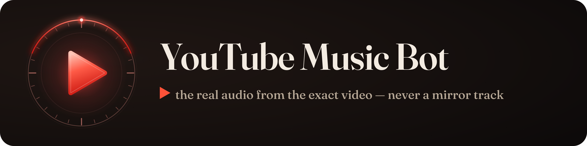

<p align="center"></p>

# discord-yt-music-bot

A Discord bot that plays YouTube audio in voice channels. It plays the real audio from the exact YouTube video you give it — never a re-uploaded or "mirror" audio track. Supports direct URL playback, search-and-pick via button menus, per-guild queues with prefetch, and configurable admin controls.

---

## Discord Application Setup

### 1. Create a Discord Application

1. Go to <https://discord.com/developers/applications> and click **New Application**.
2. Give it a name (e.g. `yt-music-bot`) and click **Create**.
3. Select **Bot** in the left sidebar.
4. Click **Add Bot** (or **Reset Token** if it already exists), then copy the **Token** — this is your `DISCORD_TOKEN`.

### 2. Enable Privileged Intents

Still on the **Bot** page, scroll down to **Privileged Gateway Intents** and enable:

- **Message Content Intent** (required to read command text)

Save changes.

### 3. Invite the Bot to Your Server (OAuth2)

1. Go to **OAuth2 > URL Generator** in the left sidebar.
2. Under **Scopes**, check `bot`.
3. Under **Bot Permissions**, check:
   - View Channels
   - Send Messages
   - Connect
   - Speak
   - Use Voice Activity
4. Copy the generated URL, open it in a browser, and select the server to invite the bot to.

---

## Configuration

All configuration lives in the `environment:` block of `docker-compose.yml`. Open that file and replace the placeholder values (marked `CHANGE_ME`) with your real credentials before running the bot. Do **not** commit a `docker-compose.yml` containing real secrets — keep your filled-in copy local.

| Variable                 | Required | Default                      | Description                                                                                     |
| ------------------------ | -------- | ---------------------------- | ----------------------------------------------------------------------------------------------- |
| `DISCORD_TOKEN`          | yes      | —                            | Bot token from the Developer Portal                                                             |
| `COMMAND_PREFIX`         | no       | `?`                          | Command prefix (e.g. `?play`, `?skip`)                                                          |
| `CACHE_DIR`              | no       | `/data/cache`                | Directory for downloaded audio files                                                            |
| `CACHE_MAX_MB`           | no       | `2048`                       | Maximum cache size in megabytes                                                                 |
| `IDLE_TIMEOUT_SEC`       | no       | `300`                        | Seconds of silence before bot leaves the voice channel                                          |
| `PREFETCH_DEPTH`         | no       | `1`                          | Number of upcoming tracks to pre-download                                                       |
| `MAX_TRANSCODE_JOBS`     | no       | `2`                          | Maximum concurrent yt-dlp downloads                                                             |
| `SEARCH_RESULT_COUNT`    | no       | `5`                          | Number of search results shown in the picker (max 5)                                            |
| `ADMIN_USER_IDS`         | no       | —                            | Comma-separated Discord user IDs with admin privileges (can queue and control from any channel) |
| `MAX_TRACK_DURATION_SEC` | no       | —                            | Reject tracks longer than this (seconds); unset = no limit                                      |
| `YT_PROXY`               | no       | —                            | HTTP proxy URL for yt-dlp requests                                                              |
| `YT_COOKIES`             | no       | —                            | Path to a Netscape-format cookies file for yt-dlp                                               |
| `PO_TOKEN_PROVIDER_URL`  | no       | —                            | URL of a PO token provider for YouTube age-gated content                                        |
| `SPONSORBLOCK_REMOVE`    | no       | —                            | SponsorBlock categories to skip, comma-separated (e.g. `sponsor,selfpromo`)                     |
| `YT_PLAYER_CLIENTS`      | no       | `android_vr,web_embedded,tv` | yt-dlp player clients to try                                                                    |
| `YTDLP_TIMEOUT_MS`       | no       | `60000`                      | Timeout for yt-dlp downloads in milliseconds                                                    |

---

## Running

### Local development (with `tsx` hot-reload)

```bash
npm install
DISCORD_TOKEN=your-token-here npm run dev
```

### Production build

```bash
npm run build
DISCORD_TOKEN=your-token-here node dist/index.js
```

### Docker & Deploy

The deploy flow is:

1. **GitHub Actions** builds the image and pushes it to `ghcr.io/atvriders/discord-yt-music-bot:latest`.
2. **You** edit the `environment:` block in `docker-compose.yml` to fill in your real credentials (replace all `CHANGE_ME` placeholders).
3. **`docker compose up -d`** pulls the pre-built GHCR image and runs it with the inline config — no local build, no `.env` file needed.

```bash
# Edit docker-compose.yml first, then:
docker compose up -d
```

> **Security note**: Do not commit your filled-in `docker-compose.yml` to the repo. Keep it local. The version in the repo contains only safe placeholder values.

#### First-Time Setup

1. **GHCR package visibility**: After the first build completes on GitHub, visit the [package page](https://github.com/Atvriders/discord-yt-music-bot/pkgs/container/discord-yt-music-bot) and set the package to **Public**. Subsequent pulls will not require authentication.
2. **Fork first build**: If you forked this repo, the first GitHub Actions build requires a manual trigger. Go to **Actions > build > Run workflow > Run workflow**.

#### Weekly Updates

The CI runs on a weekly schedule (Monday 6 AM UTC) to keep `yt-dlp` and embedded EJS templates fresh. You can also manually trigger a rebuild via **Actions > build > Run workflow**.

#### PO Token Sidecar

To enable the optional `bgutil-ytdlp-pot-provider` sidecar (for YouTube age-gated content), run:

```bash
docker compose --profile pot up -d
```

`PO_TOKEN_PROVIDER_URL` in `docker-compose.yml` is already set to `http://bgutil-pot:4416` for this case; set it to `""` if you are not using the sidecar.

#### Configuration

All env vars are documented in the **Configuration** section above and are pre-populated in the `environment:` block of `docker-compose.yml`. For the web panel, update:

- `OAUTH_REDIRECT_URI` to your public URL + `/auth/callback` (must match Discord's OAuth2 redirect URI exactly)
- `PUBLIC_BASE_URL` to your public HTTPS origin (e.g. `https://music.example.com`)

#### Volumes

The named `cache` volume (`/data/cache`) stores downloaded audio files and the active session snapshot. It persists across container restarts and is automatically backed up on shutdown.

---

## Web Panel

The bot exposes an HTTP API + WebSocket for a browser-based control panel. All bot env vars remain required; add the following for the web layer:

| Variable                | Required | Default                           | Description                                                               |
| ----------------------- | -------- | --------------------------------- | ------------------------------------------------------------------------- |
| `DISCORD_CLIENT_ID`     | yes      | —                                 | OAuth2 application Client ID from the Developer Portal                    |
| `DISCORD_CLIENT_SECRET` | yes      | —                                 | OAuth2 application Client Secret                                          |
| `PUBLIC_BASE_URL`       | yes      | —                                 | Public HTTPS origin (e.g. `https://music.example.com`); no trailing slash |
| `OAUTH_REDIRECT_URI`    | no       | `<PUBLIC_BASE_URL>/auth/callback` | Override the OAuth redirect URI if it differs from the default            |
| `SESSION_SECRET`        | yes      | —                                 | Random string ≥ 32 characters used to sign session cookies                |
| `PORT`                  | no       | `8080`                            | Port the HTTP server listens on                                           |
| `HOST`                  | no       | `0.0.0.0`                         | Interface to bind                                                         |
| `TRUST_PROXY`           | no       | `true`                            | Set to `false` only if not behind a reverse proxy                         |
| `ALLOWED_WS_ORIGINS`    | no       | `<PUBLIC_BASE_URL>`               | Comma-separated list of allowed WebSocket upgrade origins                 |

### OAuth2 Redirect URI

In the [Discord Developer Portal](https://discord.com/developers/applications), open your application, go to **OAuth2 > Redirects**, and add the exact URI:

```
<PUBLIC_BASE_URL>/auth/callback
```

The URI must be an **exact match** (Discord rejects anything that differs by even a trailing slash).

### Reverse Proxy

Run the bot behind nginx, Caddy, or similar that terminates TLS and forwards to `PORT`. Example nginx snippet:

```nginx
location / {
    proxy_pass http://127.0.0.1:8080;
    proxy_set_header Host $host;
    proxy_set_header X-Forwarded-For $proxy_add_x_forwarded_for;
    proxy_set_header X-Forwarded-Proto $scheme;
    # Required for WebSocket upgrades:
    proxy_http_version 1.1;
    proxy_set_header Upgrade $http_upgrade;
    proxy_set_header Connection "upgrade";
}
```

Keep `TRUST_PROXY=true` (the default) so the bot reads the real client IP from `X-Forwarded-For` for rate limiting.

### Manual Verification Checklist (Web Panel)

The items below require a real Discord application, a valid `SESSION_SECRET`, and a running reverse-proxy with TLS.

- [ ] `/healthz` returns `{"ok":true}` with HTTP 200
- [ ] `GET /auth/login` responds with 302 → `discord.com/oauth2/authorize` and sets a `sid` session cookie
- [ ] After completing the Discord OAuth flow the browser is redirected to `/` and `GET /api/me` returns the logged-in user's `id`, `username`, and `avatarUrl`
- [ ] `GET /api/guilds/:id/state` returns queue state for a guild you are in and `403` for one you are not in
- [ ] `POST /api/guilds/:id/skip` (with a valid session) returns `{"ok":true}`
- [ ] `POST /auth/logout` destroys the session; subsequent `GET /api/me` returns `401`
- [ ] Opening a WebSocket to `/ws` (with an authenticated session cookie and a matching `Origin` header) and sending `{"subscribe":"<guildId>"}` triggers a `state` push; playing or skipping a track causes a live `state` push over the socket

---

## Web Control Panel

The web control panel provides a browser-based interface for queuing tracks, viewing now-playing, managing the queue, and controlling playback across multiple Discord servers.

### Local Development

Start the Vite dev server with:

```bash
npm run dev:web
```

This launches the panel on `http://localhost:5173` with a development proxy that forwards `/api`, `/auth`, and `/ws` requests to the bot running on `:8080`. Run the bot in another terminal with `npm run dev`.

### Production

The production build compiles the web panel into `dist/public`, which the bot serves directly at `PUBLIC_BASE_URL` from the same Fastify process:

```bash
npm run build
```

This runs `build:web` (Vite → `dist/public`) and `tsc` (TypeScript → `dist`). The panel requires the Plan 3 OAuth setup: `PUBLIC_BASE_URL`, `OAUTH_REDIRECT_URI=<base>/auth/callback`, `SESSION_SECRET`, and the Discord OAuth2 credentials (`DISCORD_CLIENT_ID`, `DISCORD_CLIENT_SECRET`).

### Design

The panel uses an "After-Hours" analog-radio aesthetic with custom design tokens, a warm color palette, and staggered reveals for visual hierarchy.

### Manual Verification Checklist

The browser-based flow cannot be covered by unit tests. Verify the following with a real Discord application and a running bot:

- [ ] Open the panel, click **Login with Discord**, complete the OAuth flow, and land on the server selector
- [ ] The server selector lists only the Discord servers you belong to
- [ ] With the bot playing in one of your servers, the **Now Playing** card updates in real-time as you (or someone in Discord) play, skip, or pause a track
- [ ] The **Progress** slider shows the current playback position and updates live
- [ ] Paste a YouTube URL into the **Add** input and press Enter — the track queues instantly
- [ ] Type a search query (e.g. "lofi hip hop") and press Enter — a picker modal appears; click a result to queue it
- [ ] The **Queue** list shows all pending tracks and their requesters; clicking **✕** removes a track
- [ ] Open the panel for a server you cannot control; the panel displays **✕ No access** and disables all controls
- [ ] An admin can move the bot to their channel mid-session via `?play` in another channel or by selecting a voice channel from the panel; the current track resumes in the new channel
- [ ] The panel's voice-channel picker lets you start playback in a chosen channel when the bot isn't connected; the bot joins that channel and begins playing
- [ ] The queue **▲/▼** buttons reorder tracks and the change shows live in the **Queue** list

---

## Command Reference

All commands use the configured prefix (default `?`).

| Command                | Description                          |
| ---------------------- | ------------------------------------ |
| `?play <youtube-url>`  | Queue a video directly by URL        |
| `?play <search terms>` | Search YouTube and show a picker     |
| `?<search terms>`      | Shorthand for `?play <search terms>` |
| `?skip`                | Skip the currently playing track     |
| `?pause`               | Pause playback                       |
| `?resume`              | Resume playback                      |
| `?stop`                | Stop playback and clear the queue    |
| `?queue`               | Show the current queue               |
| `?np`                  | Show the now-playing track           |
| `?remove <n>`          | Remove queue item number `n`         |
| `?help`                | Show command help                    |

---

## Manual Verification Checklist

The items below cannot be covered by unit tests. Verify them with a real bot token and a Discord server.

### Gateway / Login

- [ ] Bot starts without error (`discord-yt-music-bot is online` in stdout)
- [ ] Bot appears as online in the Discord member list

### Voice Joining

- [ ] Join a voice channel, then type `?play https://www.youtube.com/watch?v=<id>` in a text channel
- [ ] Bot joins the voice channel and begins playing within ~10 seconds

### Playback Controls

- [ ] `?skip` skips to the next queued track (or goes idle if queue is empty)
- [ ] `?pause` pauses audio; bot stays in channel
- [ ] `?resume` resumes paused audio
- [ ] `?stop` stops playback, clears the queue, and the bot leaves the channel

### Search Picker

- [ ] Type `?play lofi hip hop` (or any search query) — bot replies with a numbered list and buttons 1–5
- [ ] Clicking button **2** (for example) queues exactly the second result and updates the message
- [ ] The queued track attribution shows the user who clicked the button

### Queue / Now Playing

- [ ] `?queue` with multiple tracks in the queue shows the full list
- [ ] `?np` shows the currently playing track and the requester's display name
- [ ] `?remove 1` removes the first upcoming track from the queue

### Idle Auto-Leave

- [ ] Queue a short track and wait; after the track ends and `IDLE_TIMEOUT_SEC` elapses with no new tracks, the bot leaves the voice channel

### Admin Controls

- [ ] A non-admin user trying to run `?play` while the bot is in a different channel receives `❌ You must be in the bot's voice channel` (or similar rejection)
- [ ] A user whose ID is in `ADMIN_USER_IDS` can queue and control from any channel; the bot does not relocate to a new channel mid-session

### Error Handling

- [ ] Providing an invalid or private/age-restricted YouTube URL returns a friendly `❌` message, not a crash
- [ ] Providing a URL to a deleted video returns a friendly `❌` message
