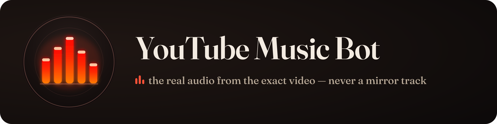

<p align="center"></p>

# discord-yt-music-bot

> _Not affiliated with, sponsored by, or endorsed by YouTube or Google. "YouTube" is a trademark of Google LLC. This is an independent open-source project._

A Discord bot that plays YouTube audio in voice channels — the **real audio from the exact video you give it**, never a re-uploaded or "mirror" audio track. It supports direct-URL playback, search-and-pick via button menus, per-guild queues with prefetch, a real-time web control panel with Discord login, and configurable admin controls.

---

## How It Works

**Exact-link, never a mirror.** Give it a YouTube URL and it plays _that_ video's audio. Give it search terms and it shows a button picker so **you** choose the exact result — it never silently substitutes a re-upload or a separate "audio" track.

**The video's own audio — no ads.** It extracts the chosen video's audio stream with `yt-dlp` (trying several player clients for reliability on datacenter IPs) and downloads it to a local cache, then streams that file into Discord voice. Because it pulls the content stream directly, there are no video ads and no SSAI mid-rolls. Optional **SponsorBlock** segment removal is supported.

**Highest-quality audio path.** When the source stream is already Opus, it is passed through to Discord **without re-encoding** (best possible quality); otherwise `ffmpeg` transcodes to Opus. Voice traffic is end-to-end encrypted (Discord's DAVE protocol) automatically.

**Per-guild orchestration.** Each server has its own queue and a mutex-guarded playback controller. Upcoming tracks are pre-downloaded (`PREFETCH_DEPTH`) so playback is gapless, and the bot auto-leaves after `IDLE_TIMEOUT_SEC` of inactivity. An active-session snapshot is written to the cache, so after a restart the bot **rejoins and resumes** automatically.

**One brain, two front-ends.** A Fastify server hosts a React control panel, a REST API, and a per-guild WebSocket. You log in with Discord OAuth2; the bot then verifies (via the gateway) that you are actually a **member** (or an admin) of a guild before letting you control it. The web panel and Discord commands share the **same** controller — anything you do on the panel affects the same playback as `?` commands, and the panel mirrors state live over the WebSocket (now-playing with a moving progress bar, the queue, and controls).

---

## Discord Application Setup

### 1. Create a Discord Application

1. Go to <https://discord.com/developers/applications> and click **New Application**.
2. Give it a name (e.g. `yt-music-bot`) and click **Create**.
3. Select **Bot** in the left sidebar.
4. Click **Reset Token** and copy the **Token** — this is your `DISCORD_TOKEN`.

### 2. Enable Privileged Intents

Still on the **Bot** page, under **Privileged Gateway Intents**, enable **both**:

- **Message Content Intent** — required to read `?` command text.
- **Server Members Intent** — required so the **web panel** can verify that a logged-in user is a member of the server before allowing control. Without it, panel controls (play/pause/skip) may be rejected with `forbidden`.

Save changes.

### 3. Invite the Bot to Your Server (OAuth2)

1. Go to **OAuth2 → URL Generator**.
2. Under **Scopes**, check `bot`.
3. Under **Bot Permissions**, check: **View Channels, Send Messages, Connect, Speak, Use Voice Activity**.
4. Open the generated URL and select the server to invite the bot.

> The bot must have **Connect** _and_ **Speak** in the specific voice channel. If a channel permission override denies **Speak**, the bot will join but produce no audio.

---

## Configuration

All configuration lives in the `environment:` block of `docker-compose.yml` — there is **no `.env` file**. Replace the `CHANGE_ME` placeholders with your real values. Do **not** commit a `docker-compose.yml` containing real secrets; keep your filled-in copy local.

### Bot

| Variable                 | Required | Default                             | Description                                                                                                                                                                                                                                                           |
| ------------------------ | -------- | ----------------------------------- | --------------------------------------------------------------------------------------------------------------------------------------------------------------------------------------------------------------------------------------------------------------------- |
| `DISCORD_TOKEN`          | yes      | —                                   | Bot token from the Developer Portal                                                                                                                                                                                                                                   |
| `COMMAND_PREFIX`         | no       | `?`                                 | Command prefix (e.g. `?play`, `?skip`)                                                                                                                                                                                                                                |
| `CACHE_DIR`              | no       | `/data/cache`                       | Directory for downloaded audio + the session snapshot                                                                                                                                                                                                                 |
| `CACHE_MAX_MB`           | no       | `2048`                              | Max cache size (MB); least-recently-used files are evicted above this                                                                                                                                                                                                 |
| `IDLE_TIMEOUT_SEC`       | no       | `300`                               | **Initial default** seconds of silence before the bot leaves the voice channel — the web panel can override this **per guild at runtime**                                                                                                                             |
| `PREFETCH_DEPTH`         | no       | `1`                                 | Upcoming tracks to pre-download (higher = smoother, more memory)                                                                                                                                                                                                      |
| `MAX_TRANSCODE_JOBS`     | no       | `2`                                 | Max concurrent yt-dlp downloads (higher = more CPU/memory)                                                                                                                                                                                                            |
| `MAX_TRACK_DURATION_SEC` | no       | `14400` (compose; unset = no limit) | **Initial default** for the per-guild "Max track length" — the web panel overrides this **per guild at runtime**. Compose ships `14400` (4h) so long content (concerts) plays out-of-box; `0` / empty = no limit. Also used as an absolute sanity ceiling at resolve. |
| `SEARCH_RESULT_COUNT`    | no       | `5`                                 | Number of search results in the picker (max 5)                                                                                                                                                                                                                        |
| `ADMIN_USER_IDS`         | no       | —                                   | Comma-separated Discord user IDs with admin privileges (control any channel)                                                                                                                                                                                          |
| `LOG_LEVEL`              | no       | `info`                              | pino log level (`debug`, `info`, `warn`, `error`)                                                                                                                                                                                                                     |
| `YT_PLAYER_CLIENTS`      | no       | `android_vr,web_embedded,tv`        | yt-dlp player clients to try (see note below)                                                                                                                                                                                                                         |
| `YT_PROXY`               | no       | —                                   | Residential/SOCKS proxy for yt-dlp, if your IP is blocked by YouTube                                                                                                                                                                                                  |
| `YT_COOKIES`             | no       | —                                   | Path to a mounted Netscape `cookies.txt` (helps on flagged IPs)                                                                                                                                                                                                       |
| `YT_COOKIES_TEXT`        | no       | —                                   | Inline cookies pasted into compose — a `cookies.txt` export **or** a one-line browser `Cookie:` header. A **seed only**: once the jar exists it is not re-applied on restart (see [Cookies & the cookie console](#cookies--the-cookie-console))                       |
| `COOKIE_ADMIN_PASSWORD`  | no       | —                                   | Enables the in-panel **cookie console**. Unset = the console is OFF (routes `404`, UI hidden). Its own password, deliberately **not** the Discord login                                                                                                               |
| `COOKIE_BROWSER_PROFILE` | no       | —                                   | The chromium sidecar's user-data-dir (read-only mount) for one-click cookie import. Unset = paste-only console                                                                                                                                                        |
| `PO_TOKEN_PROVIDER_URL`  | no       | —                                   | PO-token provider URL; only set when running the `pot` sidecar                                                                                                                                                                                                        |
| `SPONSORBLOCK_REMOVE`    | no       | —                                   | SponsorBlock categories to skip (e.g. `sponsor,intro,outro,selfpromo`)                                                                                                                                                                                                |
| `NORMALIZE_LOUDNESS`     | no       | `false`                             | **Initial default** for the per-guild "normalize loudness" (EBU R128) toggle — the web panel overrides this per guild at runtime                                                                                                                                      |

### Web panel (also required for the panel)

| Variable                | Required | Default                           | Description                                                                                                                                 |
| ----------------------- | -------- | --------------------------------- | ------------------------------------------------------------------------------------------------------------------------------------------- |
| `DISCORD_CLIENT_ID`     | yes      | —                                 | OAuth2 application Client ID                                                                                                                |
| `DISCORD_CLIENT_SECRET` | yes      | —                                 | OAuth2 application Client Secret                                                                                                            |
| `PUBLIC_BASE_URL`       | yes      | —                                 | Public HTTPS origin (e.g. `https://music.example.com`); no trailing slash                                                                   |
| `OAUTH_REDIRECT_URI`    | no       | `<PUBLIC_BASE_URL>/auth/callback` | Must exactly match a Discord OAuth2 redirect URI                                                                                            |
| `SESSION_SECRET`        | yes      | —                                 | Random string ≥ 32 chars used to sign session cookies (NOT your token)                                                                      |
| `PORT`                  | no       | `8080`                            | Port the HTTP server listens on                                                                                                             |
| `HOST`                  | no       | `0.0.0.0`                         | Interface to bind                                                                                                                           |
| `TRUST_PROXY`           | no       | `false`                           | Set `true` **only** behind a trusted reverse proxy that sets `X-Forwarded-For`; otherwise clients can spoof XFF and bypass the rate limiter |
| `ALLOWED_WS_ORIGINS`    | no       | `<PUBLIC_BASE_URL>`               | Comma-separated origins allowed to open the live WebSocket                                                                                  |

> Generate `SESSION_SECRET` with `openssl rand -base64 32`. Never reuse your bot token for it.

---

## Running

### Local development (`tsx` hot-reload)

```bash
npm install
DISCORD_TOKEN=your-token npm run dev      # bot  (:8080)
npm run dev:web                           # panel (:5173, proxies /api /auth /ws → :8080)
```

### Production build

```bash
npm run build                             # build:web (Vite → dist/public) + tsc (→ dist)
DISCORD_TOKEN=your-token node dist/index.js
```

### Docker & deploy

The deploy flow needs no local build and no `.env`:

1. **GitHub Actions** builds the image and pushes `ghcr.io/atvriders/discord-yt-music-bot:latest` (and a `:<sha>` tag) on every push to `master`, plus a weekly rebuild to keep `yt-dlp` fresh.
2. **You** fill in the `environment:` block of `docker-compose.yml`.
3. **`docker compose up -d`** pulls the pre-built image and runs it.

```bash
docker compose up -d
```

#### First-time setup

1. **GHCR visibility** — after the first build, set the [package](https://github.com/Atvriders/discord-yt-music-bot/pkgs/container/discord-yt-music-bot) to **Public** so pulls need no auth.
2. **Forked repo** — the first Actions build needs a manual trigger: **Actions → build → Run workflow**.

#### Updating to a new build (important)

A plain `docker compose up -d` may keep your **local** cached image even when a newer `:latest` exists. Force a real re-pull + recreate:

```bash
docker compose pull bot && docker compose up -d --force-recreate bot
```

In **Portainer**, enable **"Re-pull image"** when redeploying the stack — otherwise it reuses the old image. To confirm what's actually running:

```bash
docker inspect "$(docker compose ps -q bot)" --format 'image: {{.Image}}'
docker image inspect ghcr.io/atvriders/discord-yt-music-bot:latest --format 'latest: {{.Id}}'
# the two SHAs should match
```

#### PO-token sidecar (optional)

Only needed if you switch `YT_PLAYER_CLIENTS` to `web,mweb`:

```bash
docker compose --profile pot up -d
```

and set `PO_TOKEN_PROVIDER_URL=http://bgutil-pot:4416`. With the default zero-PO-token clients you do **not** need this.

---

## Cookies & the cookie console

yt-dlp needs a signed-in YouTube session for two things: getting past **"Sign in to confirm you're
not a bot"** on a flagged IP, and playing **age-restricted** videos whose uploader disabled
embedding. That session expires every few weeks, which is why refreshing it used to mean editing
`docker-compose.yml` and redeploying.

### The jar is self-maintaining

Given `--cookies`, yt-dlp does not merely _read_ the file — it writes the jar **back** after each
run, so YouTube's constantly-rotating auth tokens (`__Secure-*SIDTS`, `SIDCC`, …) stay fresh on
disk by themselves.

`YT_COOKIES_TEXT` is therefore a **seed, not a source of truth**. It is written to
`<CACHE_DIR>/yt-cookies.txt` on first boot and then left alone; a fingerprint of the pasted text
is kept beside it (`yt-cookies.source`) so the file is only rewritten when _you_ change the paste.
Re-applying it on every restart — which is what earlier versions did — threw away every rotated
token and reset the session to a weeks-old paste, so it aged out and the bot landed back on the
bot check. If the jar is deleted but the stamp survives, the seed is written again.

An unwritable `CACHE_DIR` (ENOSPC, a bad bind-mount) **degrades to "no cookies"** and logs it; it
never crashes the container.

### The console

Set `COOKIE_ADMIN_PASSWORD` to switch it on. Then, in the web panel, add `#cookies` to the URL and
unlock it with that password. It gives you:

- **Health** — is a jar configured, where it came from, when it was last written, and what the
  last real extraction said.
- **Test now** — resolves a real video (["Me at the zoo"](https://www.youtube.com/watch?v=jNQXAC9IVRw),
  19 s) with the jar that is live right now, so "saved" never has to be taken on faith.
- **Paste new cookies** — a `cookies.txt` export **or** a single-line browser `Cookie:` header.
  Written `0600`, hot-applied to the running extractor (**no restart**), then tested.
- **Import from browser** — see below.

Security, deliberately:

- **Its own password.** Signing in to the panel only proves you share a server with the bot —
  the right bar for pause/skip, the wrong one for a tool that can replace the bot's Google
  session. Unset = the routes `404` and the UI never renders, so a console you never configured
  cannot be reachable. Compared in constant time; sent per request as `x-cookie-admin`.
- **`#cookies` is discoverability, not access control.** It only decides whether the _password
  prompt_ is shown. The password is the boundary and the server enforces it.
- **No cookie value ever leaves the server.** Every response is health or a verdict drawn from a
  fixed vocabulary; yt-dlp's stderr and error messages are never forwarded, because they embed
  the jar path and the line they choked on.

### Importing from the sign-in browser (the HttpOnly problem)

The auth cookies that actually matter — `SID`, `HSID`, `__Secure-1PSID` — are **HttpOnly**. No
page script can read them, so a `document.cookie` copy-paste from DevTools _cannot_ contain them
(the console will save such a jar and warn you it has no sign-in cookie in it). The two ways to
get them are a browser-extension `cookies.txt` export, or the sidecar:

```bash
# Bring up a LAN-only chromium, sign in to YouTube by hand (2FA works — a human is driving)
LAN_IP=198.51.100.10 docker compose --profile browser up -d
# → https://<LAN_IP>:8081  (self-signed cert; accept the warning)

# Wait ~30s after signing in — chromium commits cookies on a timer, closing the tab does not
# flush them — or: docker compose stop chromium
# Then press "Import from browser" in the cookie console, and take the browser down again:
docker compose --profile browser down
```

Notes that will save you an evening:

- **Never publish the sidecar on `0.0.0.0` or route it through your tunnel.** It is a logged-in
  Google session in a full browser behind one password. The default binds it to loopback.
- **`PUID`/`PGID` must be `10001`** (the bot's app uid). Chromium's profile dir is mode `0700`,
  so a mismatched uid makes it unreadable and the import button stays off.
- **HTTPS on 3001, not HTTP on 3000.** Over plain HTTP to a LAN IP the page is not a secure
  context, WebCodecs is dead, and signing in by hand is miserable.
- An import **never** overwrites a working jar unless it proves the profile was signed in.
  `--cookies-from-browser P --cookies OUT` writes `OUT` _after_ the HTTP request, so `OUT` always
  ends up holding the ~8 cookies youtube.com hands an anonymous visitor — meaning a
  "did we get a file?" check passes even for a profile with nothing in it. The import stages to a
  temp file and promotes it only if yt-dlp reports a non-zero count read from the profile _and_ a
  real `google.com`/`youtube.com` auth cookie with a non-empty value is present. Otherwise the
  staged file is discarded and the live jar is untouched.

### Troubleshooting

| Symptom                                                  | Cause                                                                                                         |
| -------------------------------------------------------- | ------------------------------------------------------------------------------------------------------------- |
| Console doesn't appear at all                            | `COOKIE_ADMIN_PASSWORD` is unset — routes `404` by design.                                                    |
| Prompt doesn't appear                                    | Add `#cookies` to the panel URL.                                                                              |
| Import button missing                                    | `COOKIE_BROWSER_PROFILE` unset, or no chromium cookie DB under it (sidecar down, wrong dir, or PUID ≠ 10001). |
| "that profile is not signed in to YouTube"               | Sign in inside the sidecar, then wait ~30 s (or `docker compose stop chromium`) before importing.             |
| "saved, but this jar carries no YouTube sign-in cookies" | You pasted `document.cookie`. The auth cookies are HttpOnly — use an export or the sidecar import.            |
| "some cookies could not be decrypted and were dropped"   | The sidecar acquired a keyring and is writing v11 cookies; it must run with `--password-store=basic`.         |

## Deployment Notes & Gotchas

These are the things that most commonly break a self-host:

- **The cache volume must be writable by the container's non-root user.** The container starts as root only long enough to `chown` `/data/cache` (via a `gosu` entrypoint), then drops to an unprivileged user — so a named volume _or_ a bind-mounted host directory works automatically. If you previously had a root-owned volume causing `EACCES` (silent no-audio + snapshot crash-loop), pulling the current image fixes it.
- **`ALLOWED_WS_ORIGINS` must equal `PUBLIC_BASE_URL` exactly.** The live "now playing" box, progress bar, and queue are driven entirely by a WebSocket; if the browser's `Origin` isn't allowlisted, the upgrade is rejected (`403 bad_origin`) and the panel never updates — even though Discord audio plays fine.
- **`YT_PLAYER_CLIENTS` should stay on the zero-PO-token defaults** (`android_vr,web_embedded,tv`). Using `web`/`mweb` requires the PO-token sidecar above, or extraction silently fails (resolves metadata but downloads nothing → no audio).
- **Your proxy/CDN must forward WebSocket upgrades** (see the nginx snippet below). Behind **Cloudflare**, ensure zone **Network → WebSockets** is **On** (default). With a **Cloudflare Tunnel**, WebSockets are forwarded automatically — just avoid forcing an HTTP/2 origin connection, which breaks the `Upgrade`.
- **Voice "Speak" permission** — if the bot is in the channel but silent with no error, check it has **Connect + Speak** there.
- **Memory** — `node` + `yt-dlp` + `ffmpeg` per `PREFETCH_DEPTH`/`MAX_TRANSCODE_JOBS` can be heavy on a small VPS. If the container is OOM-killed mid-song (it restarts and resumes), lower `PREFETCH_DEPTH`/`MAX_TRANSCODE_JOBS` and/or set a `mem_limit`.

### Reverse proxy (nginx)

```nginx
location / {
    proxy_pass http://127.0.0.1:8080;
    proxy_set_header Host $host;
    proxy_set_header X-Forwarded-For $proxy_add_x_forwarded_for;
    proxy_set_header X-Forwarded-Proto $scheme;
    # Required for WebSocket upgrades:
    proxy_http_version 1.1;
    proxy_set_header Upgrade $http_upgrade;
    proxy_set_header Connection "upgrade";
}
```

Behind this proxy, set `TRUST_PROXY=true` so rate limiting reads the real client IP from
`X-Forwarded-For`. It defaults to `false` (off) and must be enabled **only** when a trusted
proxy like this one sets the header — otherwise clients could spoof it to dodge the limiter.

### OAuth2 redirect URI

In the [Developer Portal](https://discord.com/developers/applications) → your app → **OAuth2 → Redirects**, add the **exact** URI (Discord rejects even a trailing-slash mismatch):

```
<PUBLIC_BASE_URL>/auth/callback
```

---

## Web Control Panel

A browser interface for queuing, viewing now-playing, managing the queue, and controlling playback across all the servers you share with the bot. It uses a YouTube-style dark theme.

What it does:

- **Discord login** — OAuth2; only servers you actually belong to appear, and control is gated on membership/admin.
- **Remembers your last server** — defaults back to the server you last used.
- **Auto-selects your voice channel** — if you're already in a voice channel, the picker defaults to it (your manual choice still wins).
- **Live now-playing with an interactive progress bar** — elapsed/duration ticks in real time and freezes when paused; updates instantly on play/skip/pause from either the panel or Discord. Click anywhere on the bar (or drag its handle) to scrub — playback jumps to that position. Seeking transcodes from the offset (ffmpeg `-ss`), so there is a brief audible gap (typically under a second) while the new stream spins up.
- **Instant submit** — paste a link and press Enter; the box clears and shows "Resolving…" immediately while extraction runs in the background, then "Queued: …".
- **Queue management** — see pending tracks + requesters, remove (✕), and reorder (▲/▼), all reflected live.
- **Idle-timeout setting** — choose how long the bot stays in the voice channel after playback ends (1/5/10/15/30 minutes, or "Never"), per server, from a dropdown. Defaults to 5 minutes and overrides `IDLE_TIMEOUT_SEC` at runtime; changes apply immediately (a running idle timer restarts).

### Manual verification (web panel)

Requires a real Discord app, a valid `SESSION_SECRET`, and a TLS reverse proxy.

- [ ] `/healthz` returns `{"ok":true}` (HTTP 200)
- [ ] `GET /auth/login` → 302 to `discord.com/oauth2/authorize`, sets the `sid` cookie; after consent you land on `/` and `GET /api/me` returns your `id`/`username`/`avatarUrl`
- [ ] The server selector lists only servers you belong to and defaults to your last-used one
- [ ] With the bot playing, **Now Playing** updates live and the progress bar advances; pausing freezes it
- [ ] Click anywhere on the progress bar (or drag its handle) to scrub — playback jumps to that position (a brief audible gap is expected while ffmpeg re-opens the cached file at the new offset)
- [ ] Paste a URL → box clears + "Resolving…" → "Queued: …"; a search query opens the picker
- [ ] The voice-channel picker defaults to the channel you're in; **Queue** shows tracks + requesters; ✕ removes; ▲/▼ reorder — all live
- [ ] The **Leave channel after tracks end** dropdown reflects the current per-guild setting (default 5 min); changing it persists for that guild and takes effect immediately; `GET /api/guilds/:id/settings` returns `{ "idleTimeoutSec": … }` and `POST` with `{ "idleTimeoutSec": 0..3600 }` applies it (out-of-range → `400`)
- [ ] A server you can't control shows **No access** with controls disabled
- [ ] `POST /api/guilds/:id/skip` with a valid session returns `{"ok":true}`; without a session, `401`; `GET /api/guilds/:id/state` returns `403` for a guild you're not in
- [ ] `POST /api/guilds/:id/seek` with `{"positionMs":<n>}` scrubs the current track (validates `0 <= positionMs <= durationMs`; `409` when nothing is playing, `400` out of range)
- [ ] `POST /auth/logout` destroys the session; `GET /api/me` then returns `401`

---

## Command Reference

All commands use the configured prefix (default `?`).

| Command                | Description                                                                                               |
| ---------------------- | --------------------------------------------------------------------------------------------------------- |
| `?play <youtube-url>`  | Queue a video directly by URL                                                                             |
| `?play <search terms>` | Search YouTube and show a button picker                                                                   |
| `?<search terms>`      | Shorthand for `?play <search terms>`                                                                      |
| `?skip`                | Skip the currently playing track                                                                          |
| `?pause`               | Pause playback (bot stays in the channel)                                                                 |
| `?resume`              | Resume playback                                                                                           |
| `?stop`                | Stop playback and clear the queue; **the bot stays in the channel** (it leaves later on the idle timeout) |
| `?queue`               | Show the current queue                                                                                    |
| `?np`                  | Show the now-playing track                                                                                |
| `?remove <n>`          | Remove queue item number `n`                                                                              |
| `?help`                | Show command help                                                                                         |

---

## Manual Verification (Discord)

Requires a real bot token and a server.

### Gateway / voice

- [ ] Bot logs `discord-yt-music-bot is online` and appears online in Discord
- [ ] Join a voice channel, `?play https://www.youtube.com/watch?v=<id>` → bot joins and plays within ~10s

### Playback controls

- [ ] `?skip` advances (or goes idle if the queue is empty)
- [ ] `?pause` pauses; bot stays in channel — `?resume` resumes
- [ ] `?stop` stops playback and clears the queue; the bot **stays in the channel** and leaves later once `IDLE_TIMEOUT_SEC` elapses with nothing playing

### Search / queue

- [ ] `?play lofi hip hop` → numbered list with buttons 1–5; clicking **2** queues exactly the second result, attributed to the clicker
- [ ] `?queue` lists pending tracks; `?np` shows the current track + requester; `?remove 1` removes the first upcoming track

### Idle auto-leave & admin

- [ ] After the queue ends and `IDLE_TIMEOUT_SEC` passes with no new tracks, the bot leaves
- [ ] A user in `ADMIN_USER_IDS` can queue/control from any channel; non-admins must be in the bot's channel

### Error handling

- [ ] An invalid, private, age-restricted, or deleted video returns a friendly `❌` message, not a crash
